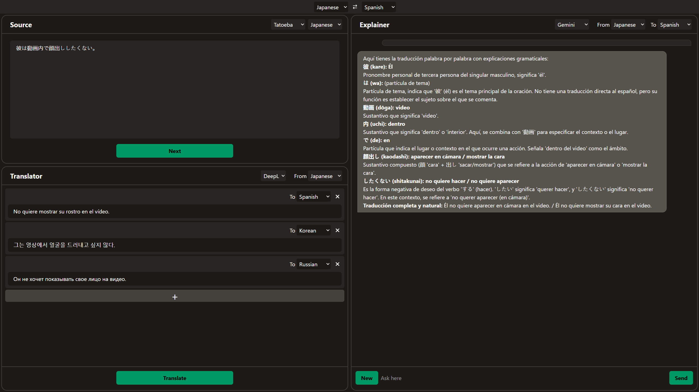
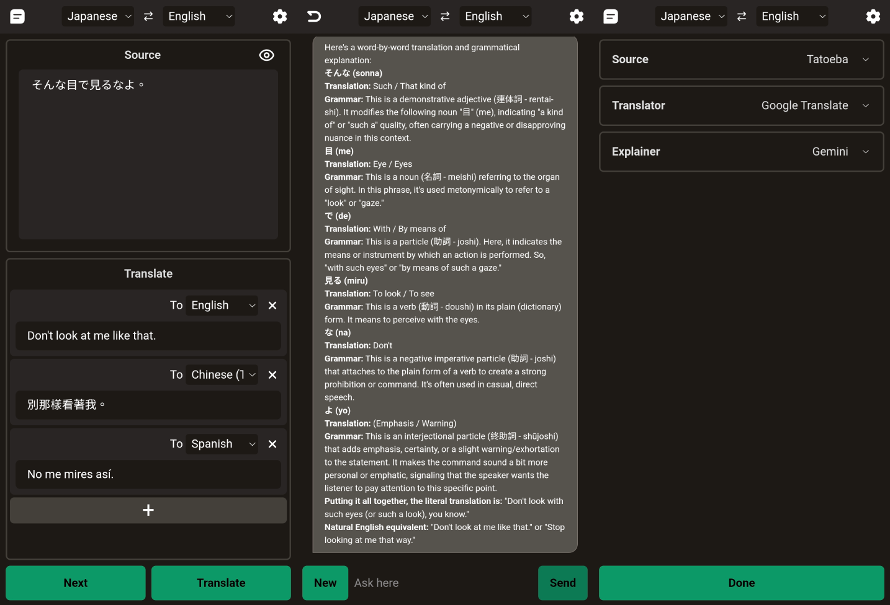

# Language Learning Zone

## Desktop

## Mobile


Language Learning Zone simplifies the flow of learning languages. You no longer need to find text from outside and search it accross different websites and applications. It intergrates into one web app. You can also implement your own provider on source, translator, or explainer.

## To-do
- [x] Fix bug in explainer about lang as name
- [ ] Support table

## Roadmap
- [x] Standardize basic lang code
- [x] Web frontend
- [x] Docker support
- [x] Mobile web UI
- [ ] Native TTS support

## Provider
### Source
+ Tatoeba
+ Wikipedia
### Translator
+ Google Translate
+ DeepL
### Explainer
+ Gemini
+ Github Models


## Before you run
Clone from .env.example and rename it to .env
Fill in data in .env file, e.g. api key

+ Use port 1668

## To run it locally

### Requirement
- bun (Tested on v1.3.9)

```bash

# install frontend dependencies
cd ./frontend
bun install

# install server dependencies
cd .. 
bun install

# run
bun run ./src/server.ts

```

## Docker
```bash

# path ./language-learning-zone
docker build -t language-learning-zone .
docker run -d -p "1668:1668" --name "language-learning-zone" language-learning-zone

```
